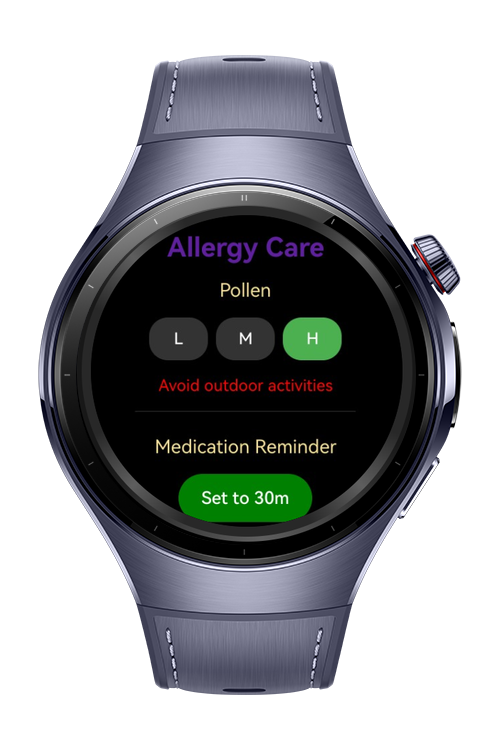
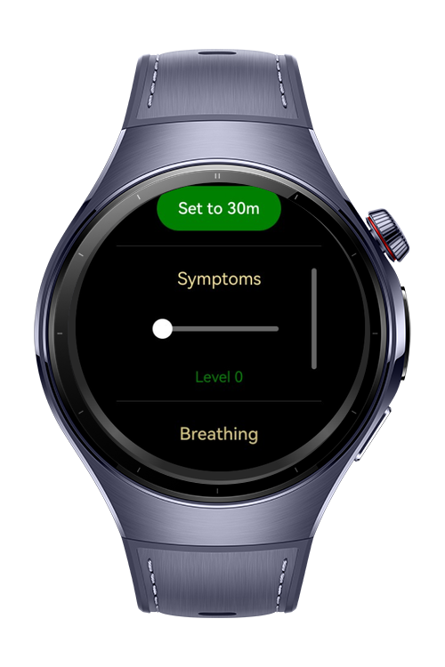

> **Note:** To access all shared projects, get information about environment setup, and view other guides, please visit [Explore-In-HMOS-Wearable Index](https://github.com/Explore-In-HMOS-Wearable/hmos-index).

# Allergy Care

Allergy Care is a lightweight wearable application designed to help users manage allergy-related health conditions through quick daily chekcs, reminders and guided breathing exercises. The app uses a single-page scrollable layout to ensure all features remain accessible on small wearable displays

# Preview

<div>
  
  
</div>

# Use Cases

**1. Allergy Awareness**

Allows users to quicky check pollen risk levels and adjust daily activities accordingly.

**2. Medication Management**

Helps users remember to take allergy medication on time through a simple timer-based reminder.

**3. Symptom Monitoring**
Enables users to track the intensity of their allergy symptoms using an intuitive slider.

**4. Breathing Relief**
Guides users through a short breathing exercise with visual animations to help reduce allergy-related discomfort.


# Tech Stack

* **Languages:** ArkTS, ArkUI
* **Frameworks:** HarmonyOS SDK 6.0.0
* **Tools:** DevEco Studio 6.0.0
* **Libraries:** @kit.ArkUI

# Constraints and Restrictions

## Supported Device

* Huawei Watch 5

# Directory Structure

```
/entry/src/main
├───ets       
    └───pages
            Index.ets

 ```

# LICENSE

**Allergy Care** is distributed under the terms of the MIT License.
See the [LICENSE](/LICENSE) for more information.
