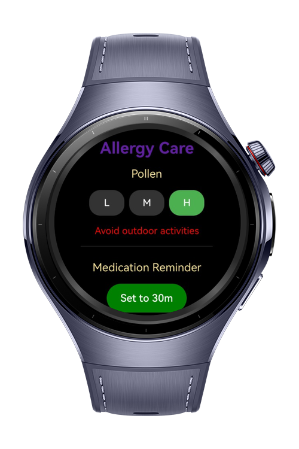
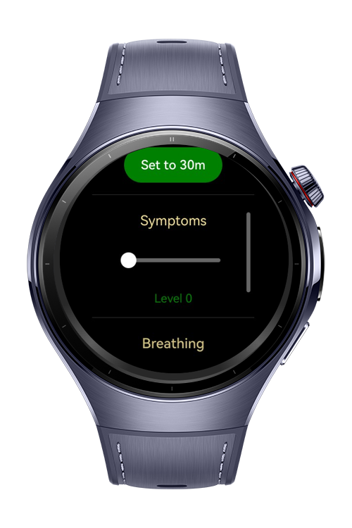

# Allergy Care

Allergy Care is a lightweight wearable application designed to help users manage allergy-related health conditions through quick daily chekcs, reminders and guided breathing exercises. The app uses a single-page scrollable layout to ensure all features remain accessible on small wearable displays

- **Persistent Health State**: Pollen levels and symptom scores are now saved automatically and persist across app restarts using @kit.ArkData.
- **System-level Reminders**: Medication timers now use the system reminderAgentManager to ensure alerts trigger even if the app is closed.
- **Proactive Pollen Alerts**: Immediate local notifications are sent when pollen risk reaches "High" levels.
- **Architecture Refactor**: Migrated to a service-oriented MVVM architecture with @Observed ViewModels for better reactivity and testability.

# Preview

<div>
  
  
</div>

# Use Cases

**1. Allergy Awareness**

Allows users to quicky check pollen risk levels and adjust daily activities accordingly.

**2. Medication Management**

Helps users remember to take allergy medication on time through a simple timer-based reminder.

**3. Symptom Monitoring**
Enables users to track the intensity of their allergy symptoms using an intuitive slider.

**4. Breathing Relief**
Guides users through a short breathing exercise with visual animations to help reduce allergy-related discomfort.

# Tech Stack

* **Languages:** ArkTS, ArkUI
* **Frameworks:** HarmonyOS SDK 6.0.0
* **Tools:** DevEco Studio 6.0.0
* **Libraries:** @kit.ArkUI

# Directory Structure

```
/entry/src/main/ets
├───services
|      NotificationService.ets
|      ReminderService.ets
|      StorageService.ets
├───viewmodel
|      AllergyViewModel.ets
└───pages
      Index.ets
 ```
 
# Constraints and Restrictions
## Supported Devices
Huawei Watch 5
 
# License (MIT)

**Allergy Care** is distributed under the terms of the MIT License.
See the [LICENSE](/LICENSE) for more information.
